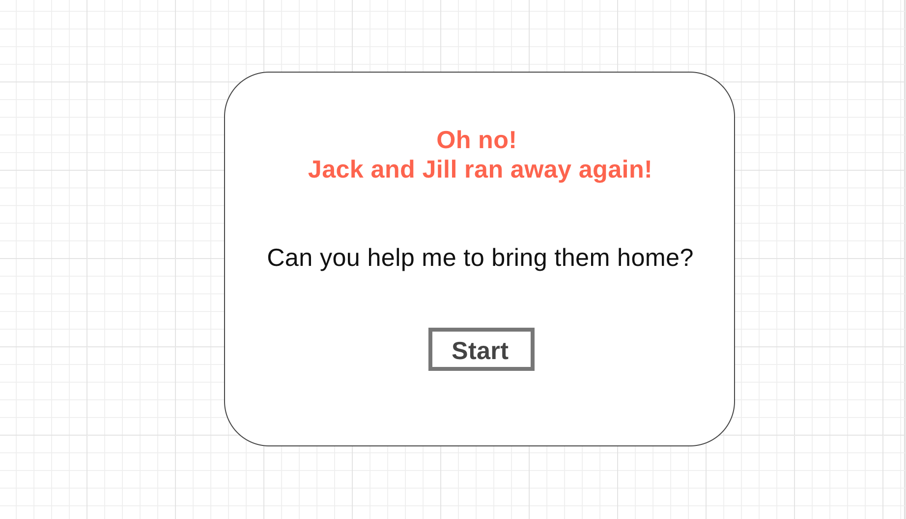
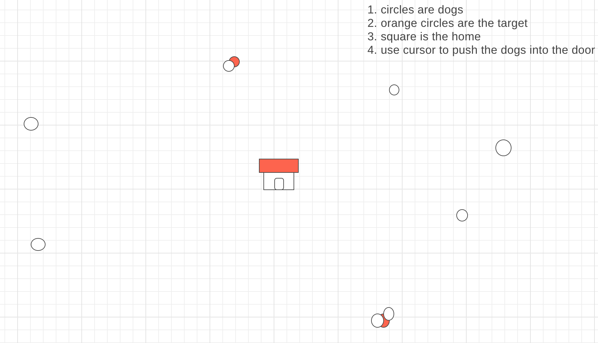

# JnJ

## Background and Overview

JnJ is a game where you use your cursor to guide Jack and Jill while hidden amongst other strays back to their home. As the levels progress, there will be more strays and it will be harder to find them and guide them home.

## Functionality & MVP

   - Player will see a dog house in the middle of the screen with many other dogs outside
   - The goal is to get the two colored dogs into their home
   - This will be achieved by using your cursor to move them towards the home and in through to door to secure a dog
   - Once both dogs are home, you will move on to the next round
   - Every level, more dogs will be added making it harder to guide home only 2 dogs

#### Architecture & Technologies
   - Javascript and HTML Canvas

## WireFrames
[Greeting Modal](https://wireframe.cc/LUjo92)

 
[Level 1 Wireframe](https://wireframe.cc/8UGtUw)

